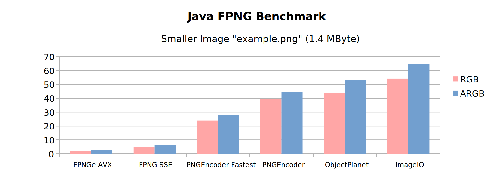
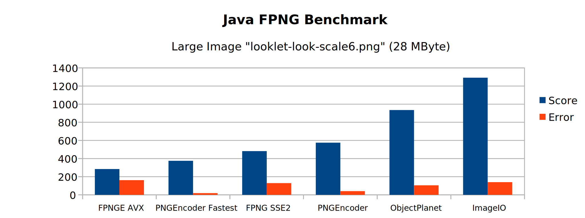

# [fpng-java](http://manticore-projects.com/fpng-java) [](https://github.com/manticore-projects/fpng-java/actions/workflows/gradle-publish.yml)  [](https://central.sonatype.com/artifact/com.manticore-projects.tools/fpng-java) [](http://makeapullrequest.com)

Java Wrapper for the fast, native [FPNG Encoder](https://github.com/richgel999/fpng) (SSE2) and the AVX2 optimised
native [FPNGe Encoder](https://github.com/veluca93/fpnge). Contains **64 bit binaries for Windows, Linux and
macOS**, built and tested on GitHub Runners. Unfortunately, **macOS ARM64 on Apple Silicon is not supported** yet.

The appropriate encoder is selected **automatically at runtime** via a `hasAVX2()` CPUID probe — the AVX2 library is never loaded on unsupported hardware. Channel conversion from Java's native ABGR/BGR format to RGBA/RGB is handled in C via SIMD byte shuffles.

**License:** [GNU Affero General Public License](https://www.gnu.org/licenses/agpl-3.0.html#license-text), Version 3 or later.

     

# How to use it

[Maven](#maven-artifacts) and [Gradle](#gradle-artifacts) artifacts are available, please see [below](#maven-artifacts).

```java
import com.manticore.tools.FPNGEncoder;     // SSE2 encoder (always safe to load)
import com.manticore.tools.FPNGE;           // AVX2 encoder (only load when supported)

// Automatic runtime selection
FPNGEncoder.ENCODER.fpng_init();
boolean useAVX2 = FPNGEncoder.ENCODER.hasAVX2() != 0;

byte[] png;
if (useAVX2) {
    png = FPNGE.encode(bufferedImage, 4, 5);        // AVX2, 4 channels, best compression
} else {
    png = FPNGEncoder.encode(bufferedImage, 4, 0);   // SSE2, 4 channels, fastest compression
}
```

There are 7 projects included:

- `encoder-java` is an abstract base class for loading the native libraries, byte arrays and tests
- `fpng` is the C++ source from [FPNG](https://github.com/richgel999/fpng) with an additional C wrapper (SSE2)
- `fpng-java` provides the Java `FPNGEncoder`, depending on `fpng` and `JNA`
- `fpnge` is the AVX2 optimised C++ source from [FPNGe](https://github.com/veluca93/fpnge) with an additional C wrapper
- `fpnge-java` provides the Java `FPNGE` encoder, depending on `fpnge` and `JNA`
- `benchmark` are optional JMH based performance tests
- `maven-test` is a minimal Java project stub for testing the Maven dependencies and the native libs on various OS after publishing

The following Gradle task will compile the native libraries with `-O3 -march=x86-64 -mtune=generic` and wrap them into JARs via JNA.

```bash
git clone --depth 1 https://github.com/manticore-projects/fpng-java.git
cd fpng-java
gradle clean assemble
```

The artifacts will be written to `fpng-java/build/libs/fpng-java-1.4.1.jar` and `fpnge-java/build/libs/fpnge-java-1.4.1.jar`.


# Benchmarks

There is a JMH based benchmark suite comparing other Java PNG Encoders, using one small and one very large PNG:

```bash
gradle clean assemble jmh
```

```text
# JMH version: 1.37, Blackhole mode: compiler
# VM version: JDK 21.0.1, OpenJDK 64-Bit Server VM, 21.0.1+12-jvmci-23.1-b19 -XX:+UseSerialGC -Xms512M -Xmx2G -XX:+UseStringDeduplication

Benchmark                               (channels)              (imageName)  Mode  Cnt     Score    Error  Units
FPNGEBenchmark.encode                            3              example.png  avgt   10     1.993 ±  0.008  ms/op
FPNGEBenchmark.encode                            3  looklet-look-scale6.png  avgt   10    84.272 ±  0.860  ms/op
FPNGEBenchmark.encode                            4              example.png  avgt   10     2.976 ±  0.014  ms/op
FPNGEBenchmark.encode                            4  looklet-look-scale6.png  avgt   10   126.364 ± 11.213  ms/op
FPNGEncoderBenchmark.encode                      3              example.png  avgt   10     5.057 ±  0.046  ms/op
FPNGEncoderBenchmark.encode                      3  looklet-look-scale6.png  avgt   10   196.432 ±  0.836  ms/op
FPNGEncoderBenchmark.encode                      4              example.png  avgt   10     6.434 ±  0.054  ms/op
FPNGEncoderBenchmark.encode                      4  looklet-look-scale6.png  avgt   10   268.631 ± 12.623  ms/op
ImageIOEncoderBenchmark.encode                   3              example.png  avgt   10    54.189 ±  0.422  ms/op
ImageIOEncoderBenchmark.encode                   3  looklet-look-scale6.png  avgt   10  1099.045 ± 13.667  ms/op
ImageIOEncoderBenchmark.encode                   4              example.png  avgt   10    64.538 ±  0.605  ms/op
ImageIOEncoderBenchmark.encode                   4  looklet-look-scale6.png  avgt   10  1270.494 ±  6.797  ms/op
ObjectPlanetPNGEncoderBenchmark.encode           3              example.png  avgt   10    43.910 ±  0.248  ms/op
ObjectPlanetPNGEncoderBenchmark.encode           3  looklet-look-scale6.png  avgt   10  1491.651 ±  8.445  ms/op
ObjectPlanetPNGEncoderBenchmark.encode           4              example.png  avgt   10    53.449 ±  0.279  ms/op
ObjectPlanetPNGEncoderBenchmark.encode           4  looklet-look-scale6.png  avgt   10  1776.148 ±  7.182  ms/op
PNGEncoderBenchmark.encode                       3              example.png  avgt   10    39.813 ±  0.517  ms/op
PNGEncoderBenchmark.encode                       3  looklet-look-scale6.png  avgt   10   854.307 ±  2.627  ms/op
PNGEncoderBenchmark.encode                       4              example.png  avgt   10    44.704 ±  0.252  ms/op
PNGEncoderBenchmark.encode                       4  looklet-look-scale6.png  avgt   10  1120.410 ±  6.746  ms/op
PNGEncoderBenchmark.encodeFastest                3              example.png  avgt   10    23.990 ±  0.173  ms/op
PNGEncoderBenchmark.encodeFastest                3  looklet-look-scale6.png  avgt   10   311.706 ±  1.456  ms/op
PNGEncoderBenchmark.encodeFastest                4              example.png  avgt   10    28.218 ±  0.202  ms/op
PNGEncoderBenchmark.encodeFastest                4  looklet-look-scale6.png  avgt   10   428.018 ±  5.281  ms/op
```



**Remark:** Score in milliseconds per encoding, smaller is better.

The **compression rates** were set to `MEDIUM` for achieving comparable file-sizes. The Java Encoders are able to achieve better compression rates at an even higher performance penalty.
`FPNG SSE` and `FPNGe AVX` achieve very competitive file-sizes for smaller images but fall-off considerably for the very large image (1.5x the size of ImageIO). Please see details in the [Benchmark Spreadsheet](src/site/sphinx/_static/benchmark.ods).

# Maven Artifacts

```xml
<dependencies>
    <!-- SSE2 encoder (always safe, also provides hasAVX2() probe) -->
    <dependency>
        <groupId>com.manticore-projects.tools</groupId>
        <artifactId>fpng-java</artifactId>
        <version>[1.4.1,)</version>
    </dependency>
    <!-- AVX2 encoder (only load at runtime when hasAVX2() returns true) -->
    <dependency>
        <groupId>com.manticore-projects.tools</groupId>
        <artifactId>fpnge-java</artifactId>
        <version>[1.4.1,)</version>
    </dependency>
</dependencies>
```

# Gradle Artifacts

```groovy
repositories {
    mavenCentral()
}
dependencies {
    // SSE2 encoder (always safe, also provides hasAVX2() probe)
    implementation 'com.manticore-projects.tools:fpng-java:[1.4.1,)'
    // AVX2 encoder (only load at runtime when hasAVX2() returns true)
    implementation 'com.manticore-projects.tools:fpnge-java:[1.4.1,)'
}
```

# To Do

- [ ] Add more test images for the "screen capturing" use case, which may yield different outcomes.
  Right now only photo-realistic images are tested.
- [ ] Drop slow JNA and replace with a JNI implementation.
- [ ] Try profiling with PGO.