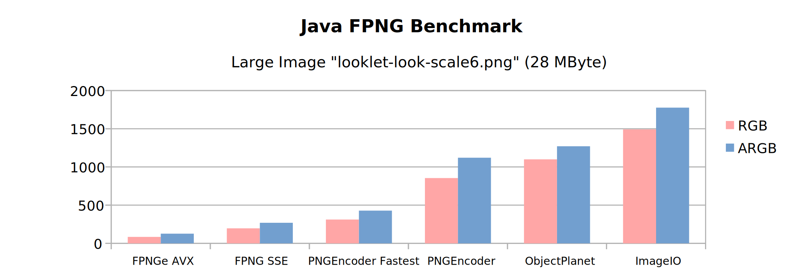

# [fpng-java](http://manticore-projects.com/fpng-java) [](https://github.com/manticore-projects/fpng-java/actions/workflows/gradle-publish.yml)

Java Wrapper for the fast, native [FPNG Encoder](https://github.com/richgel999/fpng) and the AVX optimized
native [FPNGe Encoder](https://github.com/veluca93/fpnge). Contains  **64 bit binaries for Windows, Linux and
MacOS**, built and tested on GitHub Runners.

An additional SSE translation from Java's ABGR 4 byte into the expected RGBA 4 byte arrays is provided. There is an AVX version too, which has been tested to be slower (likely due to need for a 32-bit alignment). 

     

# How to use it

[Maven](#maven-artifacts) and [Gradle](#gradle-artifacts) artifacts are available, please see [below](#maven-artifacts).

There are 7 projects included:

- `encoder` is an abstract base class for loading the native libraries, byte arrays and tests
- `fpng` is the C++ source from [FPNG](https://github.com/richgel999/fpng) with an additional C wrapper
- `fpng-java` is the Java Wrapper, depending on `fpng` and `JNA`
- `fpnge` is the AVX optimized C++ source from [FPNGe](https://github.com/veluca93/fpnge) with an additional C wrapper
- `fpnge-java` is the Java Wrapper, depending on `fpnge` and `JNA`
- `benchmark` are optional JMH based performance tests
- `maven-test` as a most simple Java project stub for testing the Maven dependencies and the Native Libs on various OS
  after publishing.

The following Gradle task will compile FPNG with `-O3 -march=x86-64' -mtune=generic` and wrap it into a JAR via JNA.

```bash
git clone --depth 1 https://github.com/manticore-projects/fpng-java.git
cd fpng-java
gradle clean assemble
```

The artifact will be written to: `.fpng-java/build/libs/fpng-java-1.1.0-SNAPSHOT.jar`

# Benchmarks

There is a JMH based benchmark suite comparing other Java PNG Encoders, using one small and one very large PNG:

```bash
gradle clean assemble jmh
```

```text
Benchmark                                           (imageName)  Mode  Cnt     Score     Error  Units
FPNGEBenchmark.encode                               example.png  avgt    3     2.773 ±   0.473  ms/op
FPNGEBenchmark.encode                   looklet-look-scale6.png  avgt    3   284.636 ± 162.091  ms/op
FPNGEncoderBenchmark.encode                         example.png  avgt    3     6.597 ±   0.175  ms/op
FPNGEncoderBenchmark.encode             looklet-look-scale6.png  avgt    3   482.187 ± 129.254  ms/op
ImageIOEncoderBenchmark.encode                      example.png  avgt    3    48.371 ±  12.259  ms/op
ImageIOEncoderBenchmark.encode          looklet-look-scale6.png  avgt    3  1292.434 ± 139.938  ms/op
ObjectPlanetPNGEncoderBenchmark.encode              example.png  avgt    3    31.850 ±   2.070  ms/op
ObjectPlanetPNGEncoderBenchmark.encode  looklet-look-scale6.png  avgt    3   935.261 ± 104.956  ms/op
PNGEncoderBenchmark.encode                          example.png  avgt    3    29.372 ±   0.738  ms/op
PNGEncoderBenchmark.encode              looklet-look-scale6.png  avgt    3   575.066 ±  40.855  ms/op
PNGEncoderBenchmark.encodeFastest                   example.png  avgt    3    17.480 ±   0.983  ms/op
PNGEncoderBenchmark.encodeFastest       looklet-look-scale6.png  avgt    3   375.172 ±  18.875  ms/op
```




# Maven Artifacts

```xml
<repositories>
    <!-- Only needed when using the FPNG SSE2 Encoder -->
    <repository>
        <id>sonatype-snapshots</id>
        <snapshots>
            <enabled>true</enabled>
        </snapshots>
        <url>https://s01.oss.sonatype.org/content/repositories/snapshots</url>
    </repository>
</repositories>
<dependencies>
    <!-- Only needed when using the FPNG SSE2 Encoder -->
    <dependency>
        <groupId>com.manticore-projects.tools</groupId>
        <artifactId>fpng-java</artifactId>
        <version>1.1.0</version>
    </dependency>
    <!-- Only needed when using the FPNGe AVX2 Encoder -->
    <dependency>
        <groupId>com.manticore-projects.tools</groupId>
        <artifactId>fpnge-java</artifactId>
        <version>1.1.0</version>
    </dependency>
</dependencies>
```

# Gradle Artifacts

```groovy
repositories {
    mavenCentral()
    maven {
        url = uri('https://s01.oss.sonatype.org/content/repositories/releases/')
    }
    // Only needed when loading Snapshots
    maven {
        url = uri('https://s01.oss.sonatype.org/content/repositories/snapshots/')
    }
}
dependencies {
    // Only needed when using the FPNG SSE2 Encoder
    implementation 'com.manticore-projects.tools:fpng-java:+'
    // Only needed when using the FPNGe AVX2 Encoder
    implementation 'com.manticore-projects.tools:fpnge-java:+'
}
```

# To Do

- [ ] Right now we compare only the speed without paying attention to the size of the encoded image. We will need to
  calibrate the benchmarks to compare only modes producing similar sizes. Also, 24bit vs 32bit modes need to be honored.
- [X] Benchmark the translation of the `BufferedImage` into the `RGBA` byte array, which is right now Pixel based and
  likely slow.
- [ ] Further we should add more test images for the "screen capturing" use case, which may yield different outcomes.
  Right now only photo-realistic images are tested.
- [X] Publish Artifact to Maven/Sonatype.
- [X] Fat/Ueber JAR with support for the 4 major Operating Systems.
- [ ] Drop slow JNA and replace with a JNI implementation.
- [X] Investigate the difference in performance on Graal JDK vs OpenJDK or JetBrains JDK.
- [ ] Try profiling with PGO.
